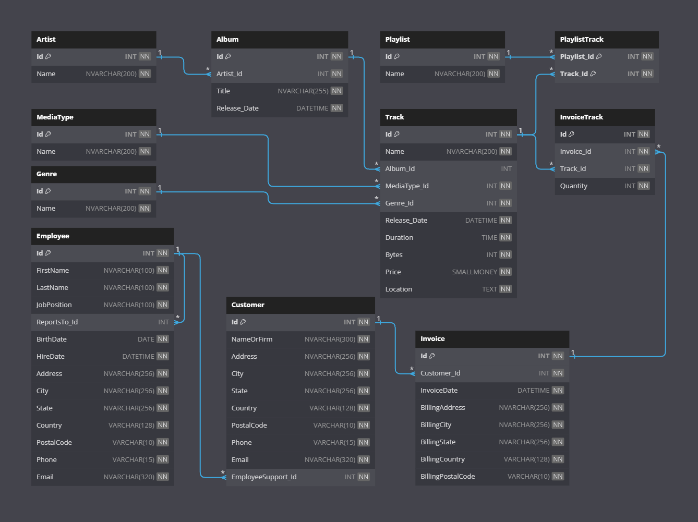

# Digit-Music
Digit Music created by Patryk 'UltiPro' Wójtowicz using SQL.

Project of a database for an online store selling digital copies of multimedia files. The application also includes sample data, procedures and queries. Project developed on Microsoft SQL Server 2019.

# Usage

To upload the database, first execute the code from the "Database.sql" file and then from the other files, except the "Drop.sql" file, which deletes the database. The "ExampleProceduresDrop.sql" file removes previously uploaded procedures from the "ExampleProcedures.sql" file. The "ExampleQueries.sql" file contains sample SQL queries that are added to the project for preview purposes only.

# Preview

